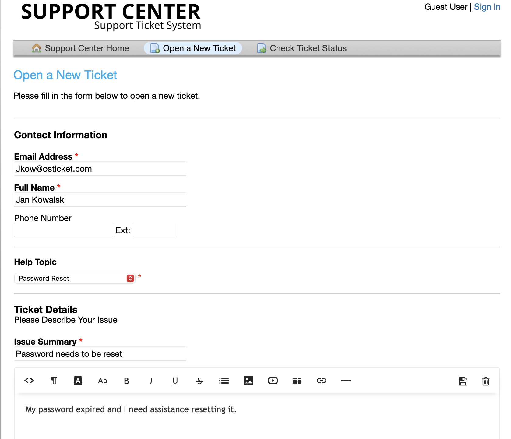
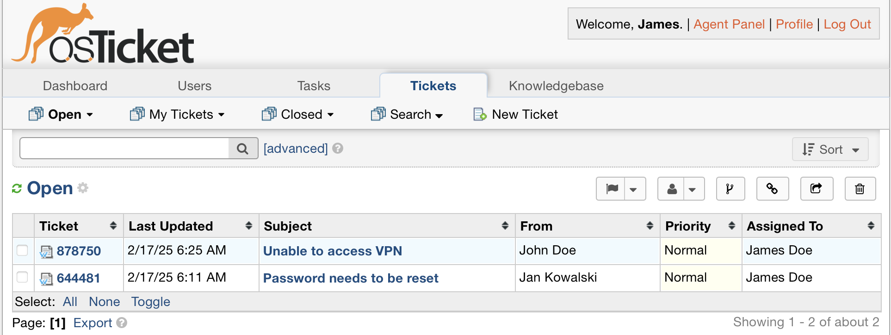
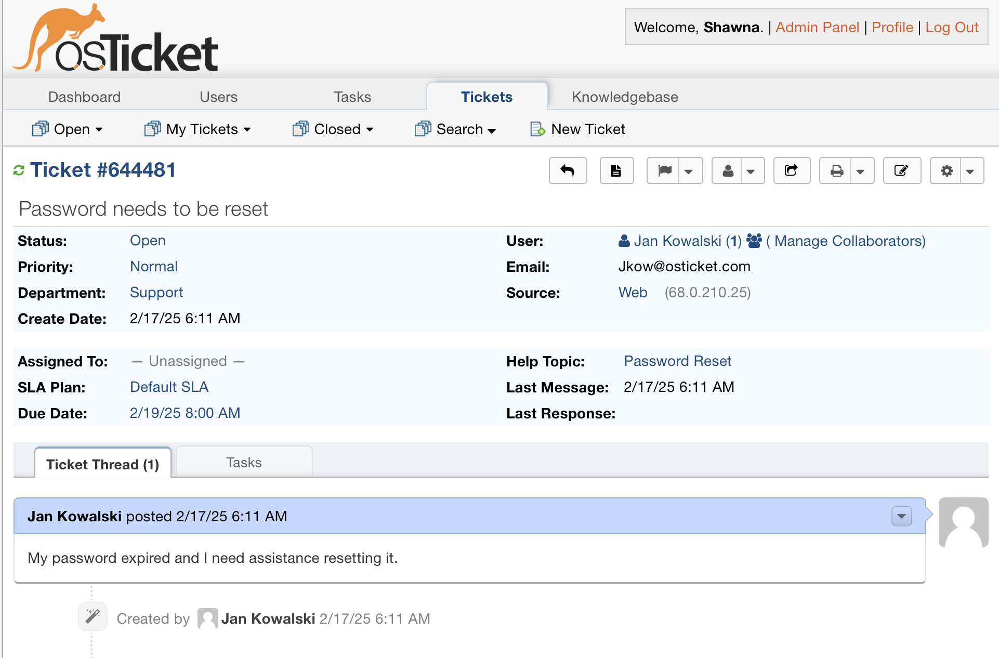
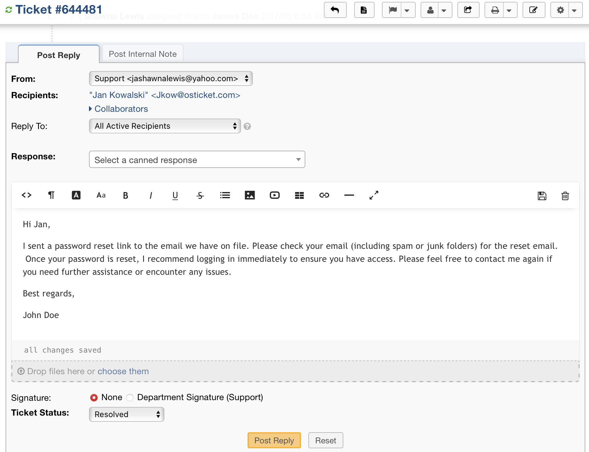

# osTicket Ticket Lifecycle

---
An example of how tickets are created and resolved.
---
## Lifecycle Summary (Status Flow)
📌 New → Open → Assigned → Resolved → Closed → Archived

## User opens a new ticket →  Help topic selection  

## User submits tickets

## Agent is assigned the new tickets in their __Tickets__ dashboard

## Open ticket thread

## Assigned agent investigates → resolves issue →  closes ticket

