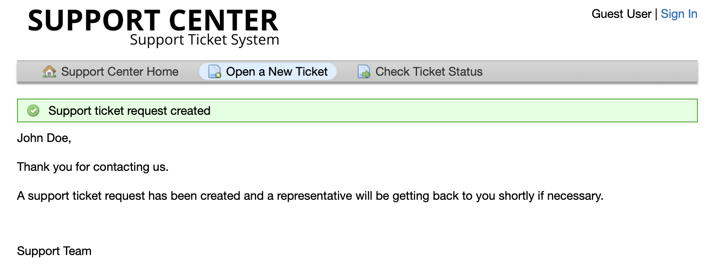

# osTicket Ticket Lifecycle

---
An example of how tickets are created and resolved.
---

## User opens a new ticket -> Help topic selection  

## User submits tickets

## Agent recieves the new tickets in their __Tickets__ dashboard

## Open ticket thread

##

